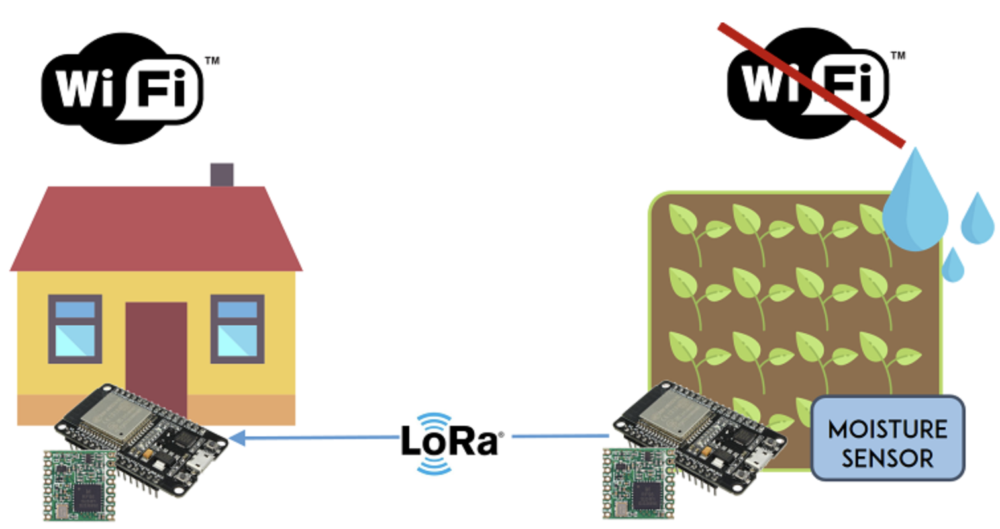
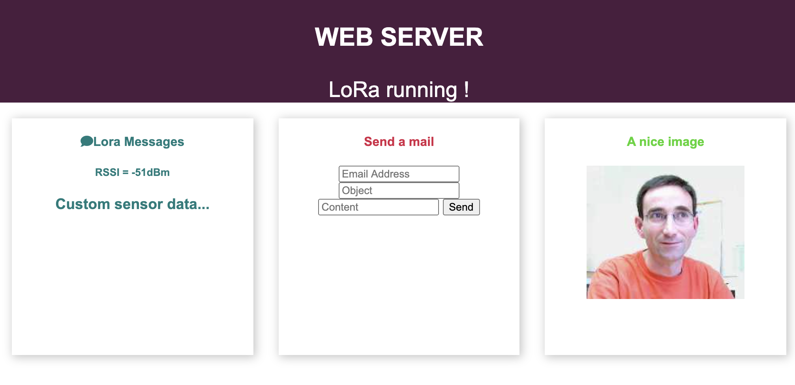

<!-- PROJECT LOGO -->
<br />
<p align="center">
  <a href="https://github.com/cchanche/esp32iot">
    
  </a>

  <h3 align="center">Projet IoT 3A IBDIoT</h3>
  <h4 align="center"><i>CHANCHEVRIER KANANE BRANTHONNE EGRETEAU</i></h4>
</p>

## A propos du projet

L'idée principale de ce projet était d'utiliser un microcontrôleur ESP32 pour l'envoi de mails. Pour la construction du code, nous avons utilisé le [code source constructeur](https://github.com/Xinyuan-LilyGO/TTGO-LoRa-Series).

## Client mail

L'objectif était, tout d'abord, de construire un mail de toute pièce, c'est-à-dire spécifier un ou plusieurs destinataires, un objet, le contenu textuel ainsi qu'une ou des pièces jointes à partir d'un script C++. Par la suite, le microcontrôleur, connecté en WIFI au point d'accès d'un de nos smartphones, pouvait se connecter auprès du serveur SMTP de gmail et donc envoyer ce précédent mail en tant que client mail.

## Serveur Web

A la suite de cela, nous avons décidé d'ajouter une certaine flexibilité au corps du mail que l'on envoyait. En effet, l'idée était de laisser le choix à l'utilisateur du corps du mail. Pour cela, nous avons utilisé notre carte ESP32 en tant que serveur web. Chaque requête de l'utilisateur vers notre carte ESP32 (à l'aide d'un quelconque navigateur) engendrait une réponse contenant une page web simple permettant de remplir les différentes parties du mail (citées précédemment). Par la suite, notre serveur web "ESP32" pouvait récupérer et envoyer le mail de la même manière que dans la partie précédente.

## Communication LoRa

Pour finir, la dernière fonctionnalité implémentée sur notre microcontrôleur ESP32 était la communication pair-à-pair à l'aide du protocole LoRaWAN avec un autre microcontrôleur du même type. L'objectif était, ici, de se placer dans un cas d'utilisation où notre microcontrôleur se trouverait en extérieur ou du moins dans une zone non couverte par le WIFI et qu'il voudrait envoyer un signal/une alerte par mail (d'où l'utilisation d'un protocole longue distance tel que LoRaWAN).

On a donc mis en place cette communication entre les deux microcontrôleurs, puis, implanté le tout sur le serveur web.

<br />
<p align="center">
  <a href="https://randomnerdtutorials.com/esp32-lora-rfm95-transceiver-arduino-ide/">
    <br />
    <i>Exemple avec capteur d'humidité</i>
  </a>
</p>

## Résultats

Voici donc l'interface web finale. On peut voire, à gauche, les informations concernant le capteur. Le RSSI correspond à l'atténuation du signal LoRa et permet d'évaluer la bonne transmission des paquets.

La partie centrale permet de rédiger et d'envoyer un mail à n'importe qui.

Et la partie droite met en évidence notre inspiration principale pour le projet.

<br />
<p align="center">
  <br />
  <i>Interface Web du receveur</i>
</p>

## Pour aller plus loin : capteurs et applications

Malheureusement, nous n'avons pas eu l'occasion d'implanter la lecture d'un véritable capteur. Le projet peut donc servir de point de départ pour quelqu'un qui souhaite implanter de l'IoT dans un cas d'utilisation quelconque.

On peut par exemple imaginer :

- Capteur de température
- Capteur d'humidité
- Accéléromètre / Gyroscope
- Capteur de lumière
- etc...

## Cloner le projet

### Prérequis

- Deux cartes [TTGO ESP32 compatible LoRa32 V2.1](https://www.amazon.fr/TTGO-Compteur-Pixels-Version-Bluetooth/dp/B07SFJ86FG/ref=sr_1_1?__mk_fr_FR=%C3%85M%C3%85%C5%BD%C3%95%C3%91&dchild=1&keywords=TTGO+Lora32&qid=1606916220&sr=8-1)
- Un câble micro-USB compatible
- Un PC sous MacOS / Linux / Windows avec une interface USB

### Installation

1. Télécharger et installer [VS Code](https://code.visualstudio.com/)
2. Installer l'extension [Platform.io](https://marketplace.visualstudio.com/items?itemName=platformio.platformio-ide)
3. Cloner le projet avec git
4. Importer le projet dans Platform.io
5. Téléverser le code sur l'emmetteur en changeant dans `/src/board_def.h`

```c
#define LORA_SENDER 1
```

6. Téléverser le code sur le serveur en changeant dans `/src/board_def.h`

```c
#define LORA_SENDER 0
```
